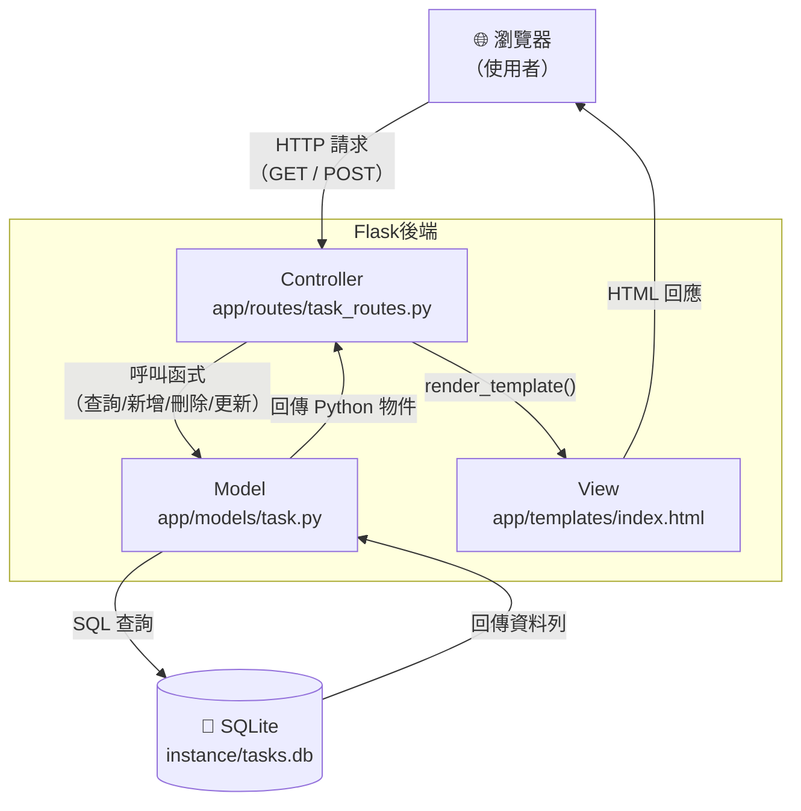

# ARCHITECTURE — 任務管理系統架構設計

> 版本：v1.0　　建立日期：2026-04-12　　對應 PRD：v1.0

---

## 1. 技術架構說明

### 1.1 選用技術與原因

| 技術 | 用途 | 選用原因 |
|------|------|----------|
| **Python Flask** | 後端 Web 框架 | 輕量、易學、適合小型專案，路由設定直覺 |
| **Jinja2** | HTML 模板引擎 | Flask 內建，支援模板繼承與變數渲染，防 XSS |
| **SQLite** | 關聯式資料庫 | 零設定、單一檔案儲存、Python 標準庫支援 |
| **HTML + CSS + JS** | 前端頁面 | 不需打包工具，初學者友善，發布簡單 |

### 1.2 Flask MVC 模式說明

本專案採用 **MVC（Model-View-Controller）** 架構模式：

| 角色 | 對應技術 | 職責說明 |
|------|----------|----------|
| **Model（模型）** | `app/models/` | 定義資料結構、負責與 SQLite 資料庫的 CRUD 操作 |
| **View（視圖）** | `app/templates/` | Jinja2 HTML 模板，負責將資料渲染成使用者看到的頁面 |
| **Controller（控制器）** | `app/routes/` | Flask 路由函式，接收請求、呼叫 Model、決定回傳哪個 View |

> 🔑 **一句話理解**：使用者送來請求 → Controller 決定要做什麼 → Model 存取資料庫 → View 把結果畫成頁面 → 回傳給使用者。

---

## 2. 專案資料夾結構

```
task_manager/               ← 專案根目錄
│
├── app/                    ← 主應用程式套件
│   ├── __init__.py         ← 初始化 Flask app、載入設定、註冊 Blueprint
│   │
│   ├── models/             ← Model 層：資料庫操作
│   │   ├── __init__.py
│   │   └── task.py         ← Task 資料模型（新增/查詢/更新/刪除任務）
│   │
│   ├── routes/             ← Controller 層：Flask 路由
│   │   ├── __init__.py
│   │   └── task_routes.py  ← 任務相關的所有路由（Blueprint）
│   │
│   ├── templates/          ← View 層：Jinja2 HTML 模板
│   │   ├── base.html       ← 基底模板（導覽列、共用 CSS/JS 引入）
│   │   └── index.html      ← 首頁：任務清單 + 新增表單
│   │
│   └── static/             ← 靜態資源
│       ├── css/
│       │   └── style.css   ← 全域樣式
│       └── js/
│           └── main.js     ← 少量前端互動邏輯（如篩選動畫）
│
├── instance/               ← 執行期產生的資料（不放入版本控制）
│   └── tasks.db            ← SQLite 資料庫檔案
│
├── app.py                  ← 應用程式入口，啟動 Flask dev server
├── schema.sql              ← 資料庫初始化 SQL（建立資料表）
├── requirements.txt        ← Python 套件清單
└── docs/                   ← 文件資料夾
    ├── PRD.md
    └── ARCHITECTURE.md     ← 本文件
```

---

## 3. 元件關係圖



### 請求流程範例：使用者新增一筆任務

```
1. 使用者在表單填入「買牛奶」並按下送出
2. 瀏覽器送出 POST /tasks/add
3. task_routes.py 的 add_task() 接收請求
4. 呼叫 task.py 的 create_task("買牛奶")
5. task.py 執行 INSERT INTO tasks ... （參數化查詢）
6. 資料存入 tasks.db
7. 路由回傳 redirect("/")，重新載入首頁
8. index.html 顯示含有「買牛奶」的最新清單
```

---

## 4. 關鍵設計決策

### 決策 1：使用 Flask Blueprint 組織路由

**選擇**：將所有任務路由放在獨立的 `task_routes.py` 並用 Blueprint 註冊。

**原因**：
- 保持 `app.py` 入口檔案簡潔
- 未來若新增「使用者」或「分類」功能，路由不會混亂
- 符合 Flask 官方推薦的模組化做法

---

### 決策 2：使用 `redirect()` 而非 AJAX

**選擇**：新增 / 刪除 / 標記完成後，伺服器回傳 `redirect("/")`，重新整理頁面。

**原因**：
- 實作簡單，不需要撰寫前端 fetch / axios 程式碼
- 對初學者友善，符合傳統表單提交流程
- 避免前後端狀態不同步的問題

> 💡 若未來需要更流暢的體驗，可在不修改後端的情況下，逐步改用 AJAX 取代表單提交。

---

### 決策 3：資料庫使用原生 `sqlite3` 而非 SQLAlchemy

**選擇**：使用 Python 標準庫 `sqlite3` 直接操作資料庫。

**原因**：
- 無需安裝額外套件，降低學習門檻
- 功能簡單，不需要 ORM 帶來的抽象層
- SQL 語法直接可見，有助於學習資料庫觀念

---

### 決策 4：模板採用繼承結構（`base.html`）

**選擇**：所有頁面模板繼承自 `base.html`。

**原因**：
- 共用的 `<head>`、CSS/JS 引入、導覽列只需寫一次
- 未來新增頁面（如「已完成任務」獨立頁）只需擴展 base
- 避免重複程式碼（DRY 原則）

---

### 決策 5：`instance/` 資料夾放入 `.gitignore`

**選擇**：`instance/tasks.db` 不納入版本控制。

**原因**：
- 資料庫包含執行期資料，不應與程式碼混在一起
- 不同開發者的本機資料不互相干擾
- 透過 `schema.sql` 任何人都能重建初始資料庫結構

---

## 5. 開發啟動流程

```bash
# 1. 安裝依賴套件
pip install -r requirements.txt

# 2. 初始化資料庫
python -c "import sqlite3; conn=sqlite3.connect('instance/tasks.db'); conn.executescript(open('schema.sql').read())"

# 3. 啟動開發伺服器
python app.py
# 或
flask run
```

瀏覽器開啟 `http://localhost:5000` 即可使用。

---

*本文件由 Antigravity AI Agent 根據 Architecture Skill 自動產生，請團隊審閱後確認。*
