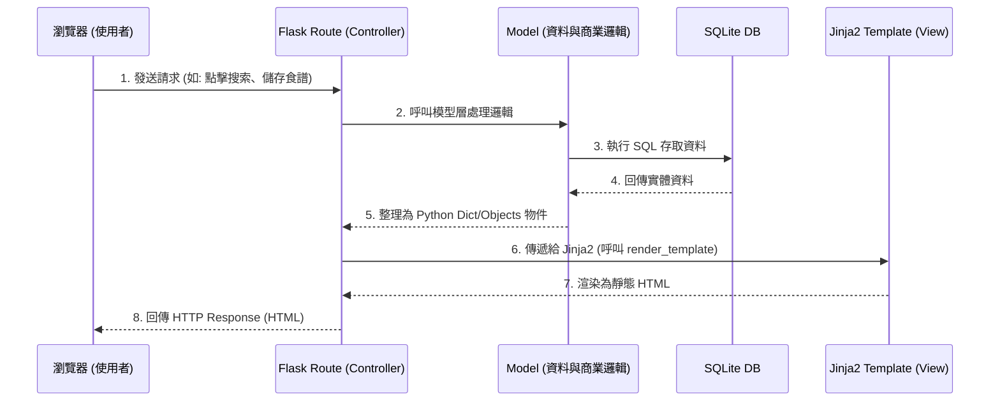

# 系統架構文件 (Architecture) - 食譜收藏夾系統

## 1. 技術架構說明

本專案採用傳統的伺服器端渲染（Server-Side Rendering, SSR）架構進行開發，由後端框架一併處理業務邏輯與畫面渲染（不採用前後端分離）。

### **1.1 選用技術與原因**
- **後端框架：Python + Flask**
  - **原因**：Flask 是一套輕量級且靈活的框架，非常適合快速開發 MVP（最小可行產品）與中小型專案。它能輕鬆處理 HTTP 請求及路由配置。
- **模板引擎：Jinja2**
  - **原因**：與 Flask 高度整合，能夠在伺服器端將資料庫查詢到的變數（如食譜清單）直接注入到 HTML 頁面中，這對於 SEO 非常有利且易於開發上手。
- **資料庫：SQLite**
  - **原因**：設定簡單，無需另外架設與維護資料庫伺服器，資料是以單一檔案（如 `database.db`）的形式存在這台主機上，非常輕量，適合開發初期與小規模資料量。

### **1.2 Flask MVC 模式說明**
雖然 Flask 本身沒有強制的目錄架構，但我們依循經典的 MVC（Model-View-Controller）模式概念來組織程式碼：
- **Model（模型）**：負責與 SQLite 資料庫溝通，處理資料的存取與商業邏輯（例如：寫入新食譜、查詢包含特定食材的食譜）。
- **View（視圖）**：負責使用者介面（UI）的呈現。在此系統中對應為放在 `templates/` 資料夾裡的 Jinja2 HTML 檔案。
- **Controller（控制器）**：在這裡對應為 Flask 的 **Routes（路由）**，負責接收使用者的請求、向 Model 要求資料處理，接著將資料丟給 View (Jinja2) 去渲染，最終組成完整的網頁回傳。

---

## 2. 專案資料夾結構

以下是本專案的目錄結構初步規劃，將模組化拆分邏輯與視圖：

```text
web_app_development/
├── app.py                 # 應用程式入口點，負責啟動 Flask 伺服器
├── requirements.txt       # Python 套件相依清單 (開發時產出)
├── instance/              # 不進入版控的特定環境檔案
│   └── database.db        # SQLite 資料庫儲存檔
├── app/                   # 核心專案內文
│   ├── __init__.py        # 建立 Flask App、註冊設定檔
│   ├── models/            # 【Model】資料庫結構定義
│   │   ├── __init__.py
│   │   ├── user.py        # 用戶資料表模型
│   │   └── recipe.py      # 食譜、食材、關聯表模型
│   ├── routes/            # 【Controller】路由處置
│   │   ├── __init__.py
│   │   ├── auth.py        # 註冊、登入與權限路由
│   │   └── recipe.py      # 食譜 CRUD 及查詢路由
│   ├── templates/         # 【View】Jinja2 HTML 模板
│   │   ├── base.html      # 共用基本排版 (含 navbar, footer 等)
│   │   ├── index.html     # 首頁 (搜尋與展示)
│   │   ├── auth/          # 用戶相關頁面 (login.html, register.html)
│   │   └── recipe/        # 食譜相關頁面 (list.html, detail.html, form.html)
│   └── static/            # 靜態資源檔案
│       ├── css/
│       │   └── style.css  # 全站共通樣式
│       └── js/
│           └── main.js    # 客製化互動操作
└── docs/                  # 文件管理
    ├── PRD.md             # 產品需求文件
    └── ARCHITECTURE.md    # 系統架構文件 (本檔案)
```

---

## 3. 元件關係圖

以下展示瀏覽器發出請求後，系統內部各個元件如何運作互動：



---

## 4. 關鍵設計決策

1. **不採用前後端分離架構**
   - **原因**：為了能快速產出 MVP（Minimum Viable Product）進行驗證，降低專案的複雜度。使用 Flask 與 Jinja2 共構，能節省掉建置前後端通訊 API、跨域（CORS）問題以及撰寫 API 文件的成本。
2. **採用關聯式資料庫設計**
   - **原因**：系統的核心需求包含「從食材組合搜尋食譜」。這具備了明顯的「多對多」（Many-to-Many）關聯特性（一個食譜有多種食材，一種食材也能在多個食譜內），關聯式資料庫的 JOIN 查詢效能可以輕鬆處理這種場景。
3. **區段式藍圖路由開發 (Flask Blueprints)**
   - **原因**：即便初期的功能只有五項，但為了避免所有邏輯長在 `app.py` 導致過於肥大，我們從第一天就導入 Flask 的 Blueprints 概念。將應用切分「會員系統」(`auth`) 與「主系統」(`recipe`)，讓日後擴充新功能更容易。
4. **模組化的模板繼承 (Template Inheritance)**
   - **原因**：將導覽列、樣式檔等共同區塊抽取至 `base.html`，其餘各種頁面繼承後只要填入專屬的 Block 內容。這能極大化減少重複的 HTML 程式碼，如果要調整全站版型（Theme），也只需要修改唯一的基礎模板即可。
