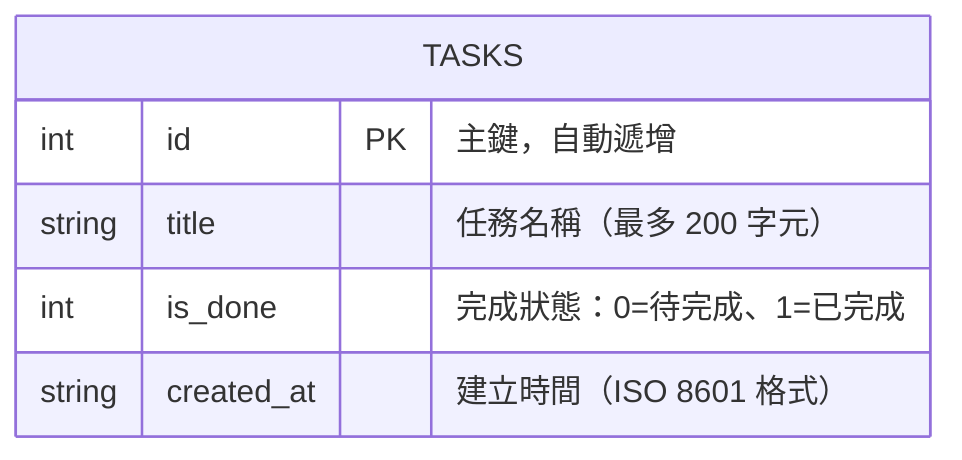

# DB_DESIGN — 任務管理系統資料庫設計

> 版本：v1.0　　建立日期：2026-04-16　　對應 PRD：v1.0 / ARCHITECTURE：v1.0

---

## 1. ER 圖（實體關係圖）

本系統 MVP 階段僅含一張核心資料表 `tasks`。



> 📌 目前系統為單一使用者設計，無需 User 資料表。若未來擴充多人功能，可新增 `users` 表並在 `tasks` 加入 `user_id` 外鍵。

---

## 2. 資料表詳細說明

### 2.1 `tasks` 資料表

儲存所有使用者建立的任務項目。

| 欄位名稱 | 型別 | 限制 | 是否必填 | 說明 |
|----------|------|------|----------|------|
| `id` | `INTEGER` | `PRIMARY KEY AUTOINCREMENT` | ✅ 自動 | 唯一識別碼，由 SQLite 自動遞增 |
| `title` | `TEXT` | `NOT NULL`，長度上限 200 | ✅ | 任務名稱，使用者輸入的待辦事項文字 |
| `is_done` | `INTEGER` | `NOT NULL`，值為 `0` 或 `1` | ✅ | 完成狀態旗標；`0` = 待完成，`1` = 已完成 |
| `created_at` | `TEXT` | `NOT NULL`，ISO 8601 格式 | ✅ 自動 | 任務建立時間，格式範例：`2026-04-16T08:00:00` |

**關鍵設計說明：**

- **Primary Key**：`id`（INTEGER PRIMARY KEY AUTOINCREMENT）
- **Foreign Key**：目前無（單使用者設計）
- `is_done` 使用 `INTEGER` 而非 `BOOLEAN`，因 SQLite 無原生布林型別，以 `0/1` 代替
- `created_at` 使用 `TEXT` 存 ISO 格式字串，方便字串排序且跨平台相容性佳

---

## 3. SQL 建表語法

完整建表語法詳見 [`schema.sql`](../schema.sql)。

```sql
CREATE TABLE IF NOT EXISTS tasks (
    id         INTEGER PRIMARY KEY AUTOINCREMENT,
    title      TEXT    NOT NULL CHECK(LENGTH(title) <= 200),
    is_done    INTEGER NOT NULL DEFAULT 0 CHECK(is_done IN (0, 1)),
    created_at TEXT    NOT NULL DEFAULT (strftime('%Y-%m-%dT%H:%M:%S', 'now', 'localtime'))
);
```

---

## 4. Python Model 對應

Model 程式碼位於 [`app/models/task.py`](../app/models/task.py)。

提供以下 CRUD 方法：

| 方法 | 對應 SQL | 說明 |
|------|----------|------|
| `create_task(title)` | `INSERT INTO tasks ...` | 新增一筆任務 |
| `get_all_tasks(filter)` | `SELECT * FROM tasks [WHERE ...]` | 取得所有任務（可帶篩選條件） |
| `get_task_by_id(id)` | `SELECT * FROM tasks WHERE id = ?` | 依 ID 取得單一任務 |
| `toggle_task(id)` | `UPDATE tasks SET is_done = NOT is_done WHERE id = ?` | 切換完成狀態 |
| `delete_task(id)` | `DELETE FROM tasks WHERE id = ?` | 刪除指定任務 |

---

*本文件由 Antigravity AI Agent 根據 DB Design Skill 自動產生，請團隊審閱後確認。*
