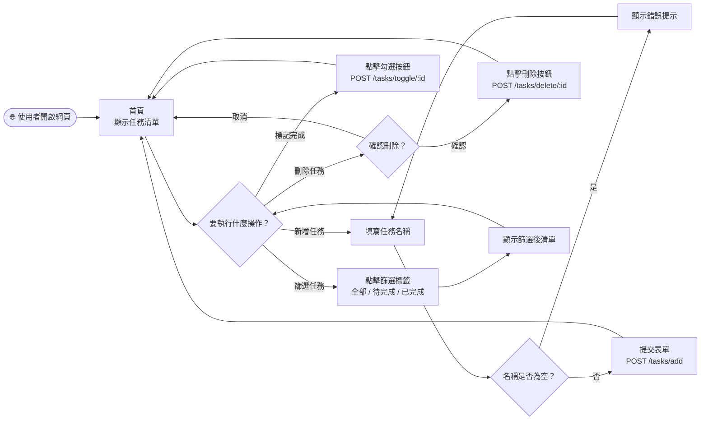
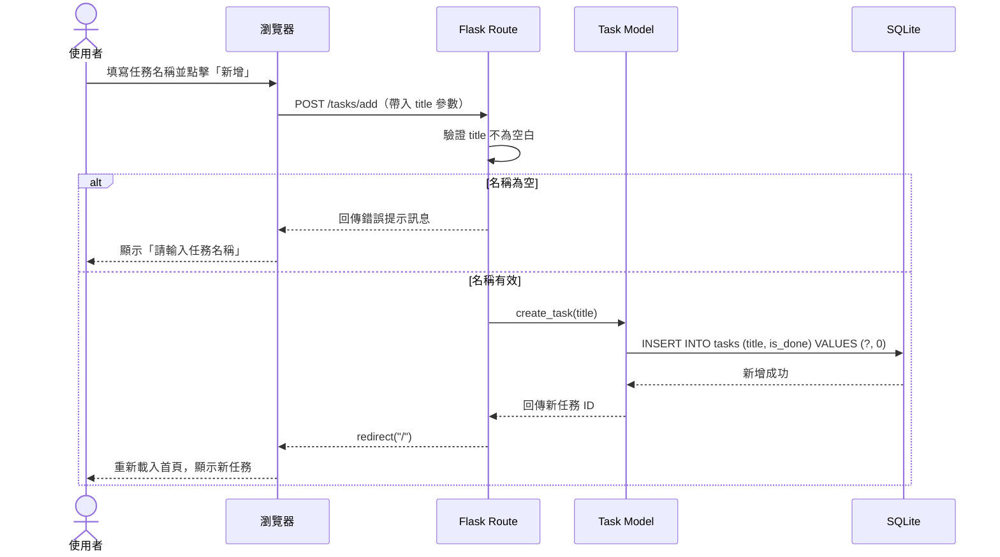
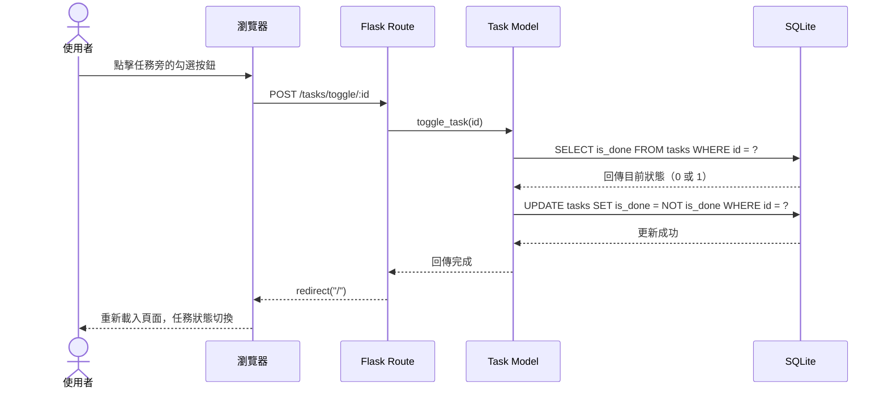
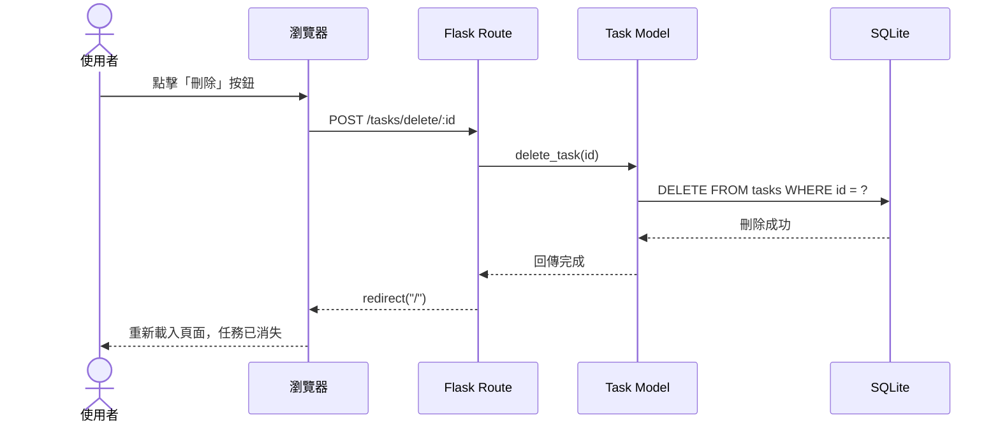
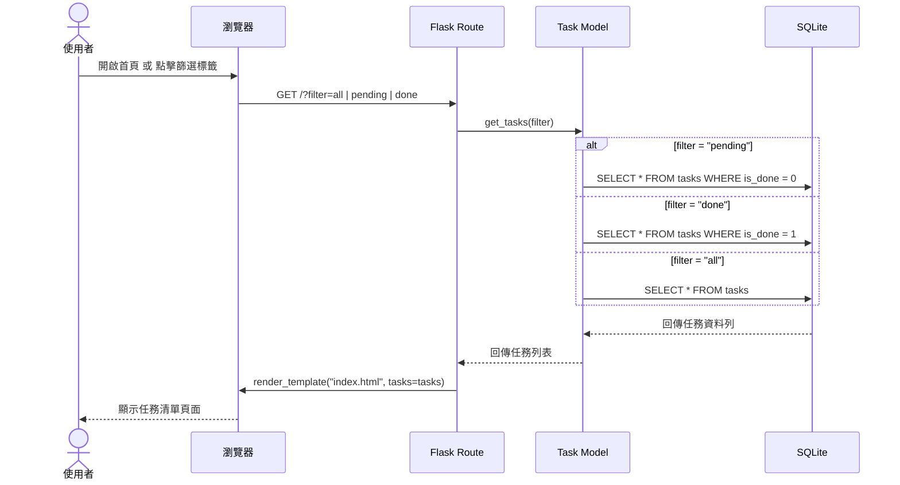

# FLOWCHART — 任務管理系統流程圖

> 版本：v1.0　　建立日期：2026-04-12　　對應 PRD：v1.0

---

## 1. 使用者流程圖（User Flow）

描述使用者從開啟網頁到完成各項操作的完整路徑。

---

## 2. 系統序列圖（Sequence Diagram）

描述各操作在系統內部的完整資料流動過程。

### 2.1 新增任務

---

### 2.2 標記任務完成 / 取消完成

---

### 2.3 刪除任務

---

### 2.4 顯示任務清單（含篩選）

---

## 3. 功能清單對照表

| 功能 | HTTP 方法 | URL 路徑 | 說明 |
|------|-----------|----------|------|
| 顯示首頁（全部任務） | `GET` | `/` | 預設顯示所有任務 |
| 顯示首頁（篩選） | `GET` | `/?filter=pending` 或 `/?filter=done` | 篩選待完成或已完成 |
| 新增任務 | `POST` | `/tasks/add` | 表單送出後新增並重導向 |
| 標記完成／取消完成 | `POST` | `/tasks/toggle/<int:id>` | 切換 is_done 狀態 |
| 刪除任務 | `POST` | `/tasks/delete/<int:id>` | 刪除指定任務並重導向 |

> ⚠️ **為何刪除和標記都用 POST 而非 DELETE / PATCH？**
> HTML 表單原生只支援 `GET` 與 `POST`，為保持簡單、不依賴 JavaScript fetch，統一使用 `POST` 處理資料變更操作。

---

*本文件由 Antigravity AI Agent 根據 Flowchart Skill 自動產生，請團隊審閱後確認。*
