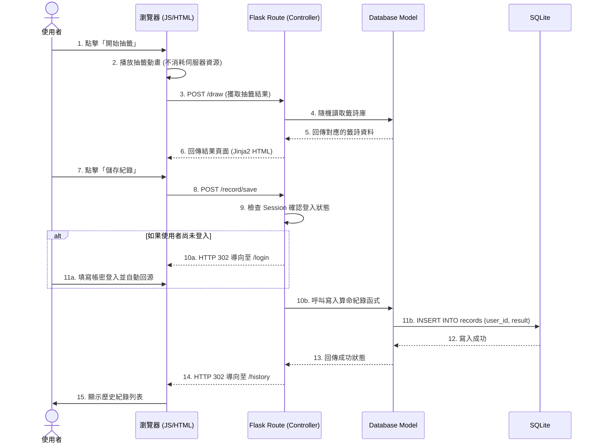

# 系統流程圖：線上算命系統

本文件根據產品需求文件 (PRD) 與系統架構文件 (ARCHITECTURE)，繪製線上算命系統的使用者流程與系統資料流。

## 1. 使用者流程圖（User Flow）

此流程圖描述使用者進入網站後，可以進行的各種操作路徑，包含抽籤互動、會員登入與後續如捐款、儲存等動作。

```mermaid
flowchart LR
    A([使用者造訪首頁]) --> B[首頁 / 導覽]
    B --> C{選擇系統功能}
    
    %% 算命抽籤主流程
    C -->|1. 開始抽籤/算命| D[前端互動動畫（擲筊/搖籤筒）]
    D --> E[顯示算命與抽籤結果]
    
    %% 抽籤結果後的後續動作
    E --> F{觀看結果後...}
    F -->|分享結果| K[呼叫社群分享 (FB/Line)]
    F -->|儲存紀錄| G{是否已登入？}
    
    G -->|未登入| I[導向登入/註冊頁面]
    I -->|登入成功| H
    G -->|已登入| H[將紀錄存入個人帳號]
    H --> J[個人歷史紀錄頁面]
    
    %% 其他功能
    C -->|2. 查看歷史紀錄| G
    C -->|3. 捐獻香油錢| L[捐獻頁面 (顯示轉帳/金流)]
    F -->|點擊香油錢| L
```

## 2. 系統序列圖（Sequence Diagram）

此序列圖描述核心情境：「**使用者進行抽籤並儲存結果**」的完整系統流轉過程。



## 3. 功能清單與路由對照表

以下整理了系統內所有的主要功能，並對應到具體的 HTTP 方法、URL 路徑，與將被渲染的 Jinja2 模板檔，以利後續的 `/api-design` 與路由開發。

| 功能名稱 | 功能說明 | URL 路徑 | HTTP 方法 | 對應視圖 (Jinja2 / Controller 行為) |
|----------|------|----------|-----------|------------------|
| **網站首頁** | 顯示系統導覽與開始算命按鈕 | `/` | GET | `index.html` |
| **會員註冊** | 填寫表單建立新使用者 | `/register` | GET, POST | `auth/register.html` |
| **會員登入** | 登入並寫入 Session | `/login` | GET, POST | `auth/login.html` |
| **會員登出** | 清除 Session 狀態 | `/logout` | GET | 無 (直接導回到首頁 `/`) |
| **執行抽籤** | 送出抽籤請求獲取隨機結果 | `/draw` | POST | 核心邏輯處理後導向 `/result/<id>` |
| **顯示結果** | 呈現籤詩或算命的詳細內容 | `/result/<id>` | GET | `result.html` |
| **儲存結果** | 將當下這筆紀錄綁定使用者帳號 | `/record/save` | POST | 無 (直接導向至 `/history`) |
| **歷史紀錄** | 列出自己過去儲存的算命結果 | `/history` | GET | `history.html` |
| **捐香油錢** | 顯示線上捐款或轉帳資訊頁面 | `/donate` | GET, POST | `donate.html` |
